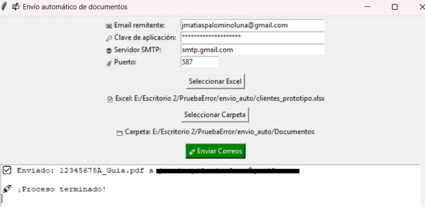

# 📬 Envío Automático de Documentos con Interfaz Gráfica

Automatiza el envío de documentos personalizados por correo electrónico sin usar un archivo `.env`. Este script permite que el usuario ingrese sus credenciales desde la interfaz, lo que lo hace ideal para compilar como `.exe` y compartirlo fácilmente.

---

## 🚀 ¿Qué hace este script?

- ✅ Lee un Excel con nombres, DNIs y correos.
- ✅ Asocia automáticamente documentos que empiezan con el DNI del destinatario.
- ✅ Envia cada documento por correo usando tu cuenta.
- ✅ Todo desde una interfaz gráfica sencilla y amigable.

---

## 🧰 Tecnologías utilizadas

- Python 3.8+
- Tkinter (interfaz gráfica)
- Pandas (lectura de Excel)
- SMTPLib (envío de correos)
- Mimetypes (gestión de adjuntos)

---

## 📸 Vista previa de la aplicación

Aquí tienes un ejemplo de cómo se ve la interfaz gráfica en ejecución:



> ⚠️ Sube una captura de pantalla al repositorio y reemplaza `ruta/a/la/imagen.png` con la ruta real (por ejemplo: `img/vista-previa.png`)

---

## 📁 Estructura recomendada

```
envio_automatico/
├── main.py                 # Script principal
├── clientes.xlsx           # Archivo Excel con los destinatarios
├── Documentos/             # Carpeta con los documentos a enviar
├── requirements.txt        # (opcional) Dependencias
└── img/                    # Carpeta con la imagen de vista previa
```

---

## 📄 Formato del archivo Excel

El archivo `clientes.xlsx` debe tener como mínimo estas columnas:

| Nombre | Apellido | DNI        | Email              |
|--------|----------|------------|--------------------|
| Juan   | Pérez    | 12345678A  | juan@email.com     |

---

## 📂 Documentos

Los archivos en la carpeta `Documentos/` deben **comenzar con el DNI del destinatario**, por ejemplo:

```
Documentos/
├── 12345678A_factura.pdf
├── 87654321B_certificado.pdf
```

---

## ▶️ Cómo usarlo

1. Ejecuta el script con:

```bash
python main.py
```

2. Ingresa:
   - Tu email (remitente)
   - Tu clave de aplicación
   - Servidor SMTP (`smtp.gmail.com` por defecto)
   - Puerto (`587` por defecto)

3. Selecciona el archivo Excel y la carpeta con documentos.
4. Haz clic en **"Enviar Correos"** y observa la magia. 🧙‍♂️✨

---

## 🔐 ¿Qué es la clave de aplicación?

Si usas Gmail, **no puedes usar tu contraseña normal**. Necesitas generar una contraseña de aplicación:

1. Activa la verificación en dos pasos:  
   👉 [https://myaccount.google.com/security](https://myaccount.google.com/security)

2. Ve a Contraseñas de Aplicaciones:  
   👉 [https://myaccount.google.com/apppasswords](https://myaccount.google.com/apppasswords)

3. Crea una clave para "Correo" → "Otro dispositivo" (por ejemplo, "PythonApp")
4. Usa esa clave en la GUI como "clave de aplicación"

---

## 💾 Crear ejecutable `.exe`

¿Quieres compartir este programa sin que el usuario necesite tener Python?

1. Instala PyInstaller:

```bash
pip install pyinstaller
```

2. Genera el `.exe`:

```bash
pyinstaller --onefile main.py
```

El ejecutable estará en la carpeta `dist/`.

> Si quieres ocultar la consola, cambia `console=True` por `console=False` en el `.spec`.

---

## 🧯 Problemas comunes

- ❌ `Authentication failed` → Usa una contraseña de aplicación válida.
- ❌ No se envían documentos → Verifica que los nombres de archivos empiecen con el DNI.
- ❌ Error de Excel → Asegúrate de tener `openpyxl` instalado.

---

## 📄 Licencia

MIT License — úsalo, compártelo, mejóralo y no envíes spam 😜

---

## 💬 Autor

Hecho con cariño, automatización y café(con Leche) ☕  
por Matias Palomino Luna
